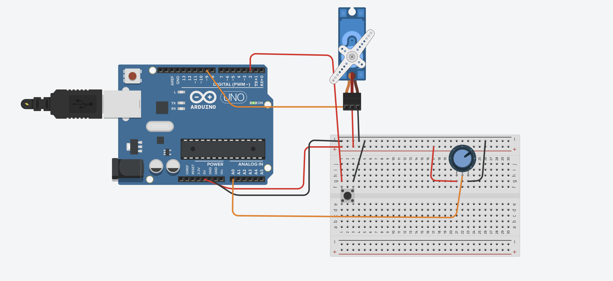
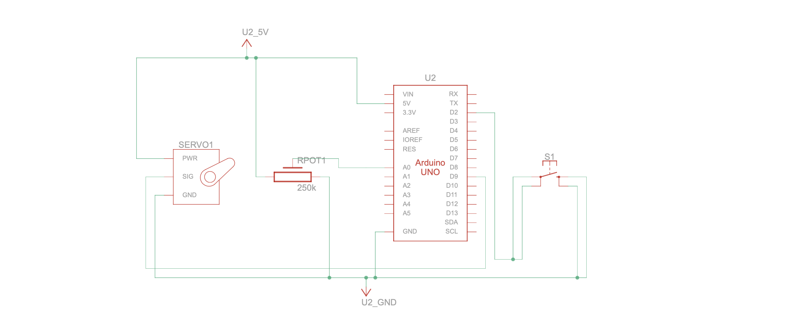
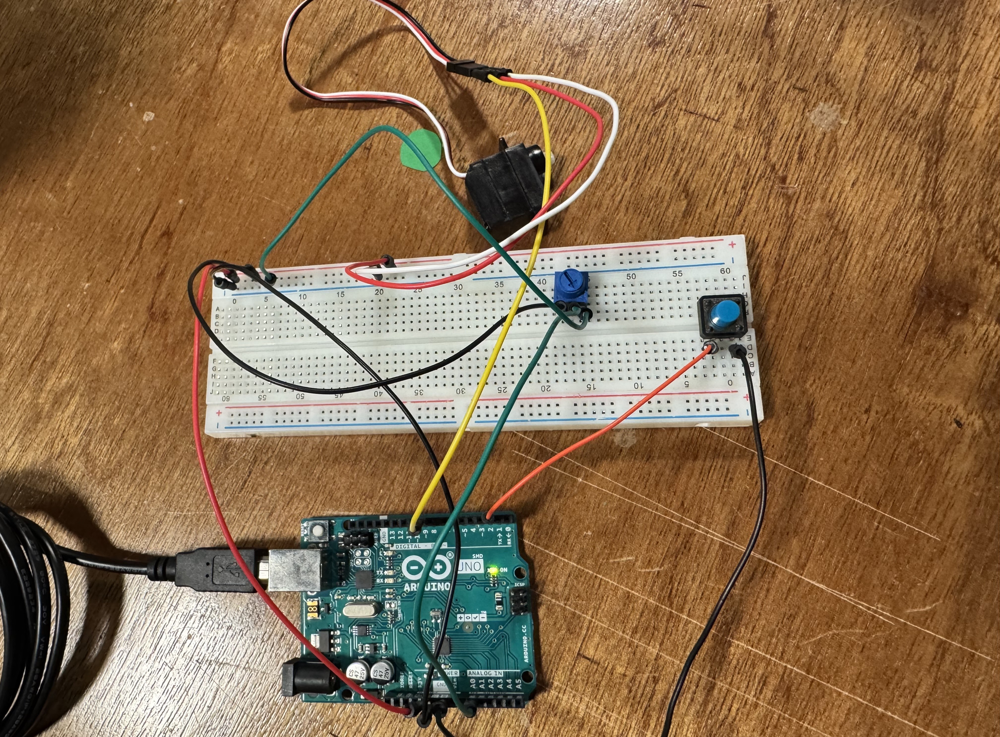
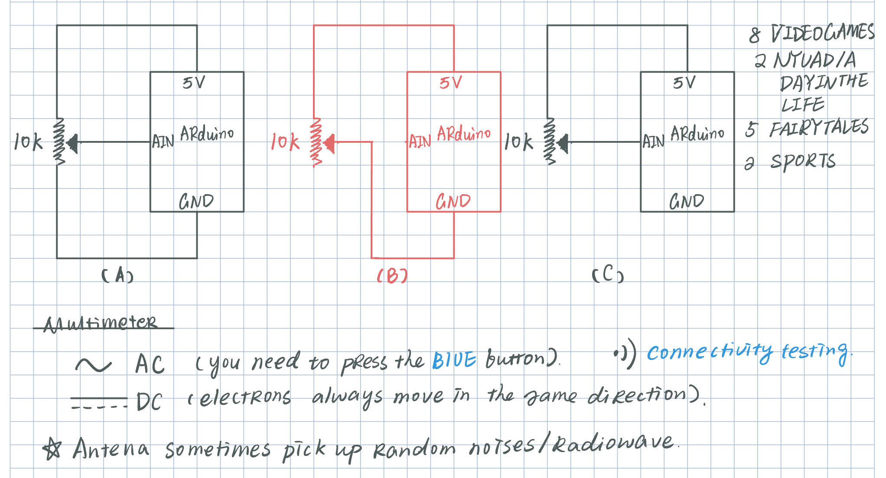

> If you fail, Congratulations! Most people don't even try.

### Jan 22 Lecture

- **Notes on the whiteboard:**

  <p align="center">
    
  </p>

- **Additional notes:**

  - For soldering, we need three hands, but as human beings we only have two. That’s why we use a third hand tool (a stand that holds the wire in place). Adjust the helping hands so you can solder comfortably.
  - Wires are usually made of copper. Stranded wire is better for long term use, and solid wire is better for short term use.
  - To strip a wire, clamp at the right gauge (which match the diameter of the wire), then squeeze and pull to remove the insulation.
  - Do not inhale the white smoke/ hold your breath.
  - Do not jab the tip into the brass cleaner aggressively.
  - An actuator is the opposite of a sensor.
  - A DC motor uses voltage or PWM to control speed and torque, while a servo motor is a motor plus a gearbox, a sensor (usually a potentiometer or encoder), and control electronics in one package. Servos are good at precise positioning and holding a position against a load.
  - The black part of the iron tip is oxidized; use the shiny part for soldering.

### Jan 22 Practice Soldering 1

- Practice soldering some wires and some header pins to a circuit board from
  the "practice" bin. Bring the board to class and show us your five best
  wires and five best pins.

  <p align="center">
    
  </p>

**Preparation:**

  <figure align="center">
    
  </figure>

  - Strip the wire -> grab header pins and a perfboard -> Use the helping hands to hold the header pins and perfboard in place, then of course use your amazing clamping skills and a steady hand to keep everything perfectly aligned -> how about a PCB?

---

### Jan 25 Studying

- **Reading resources:** 
    - Read and watch [Soldering
    Resources](https://github.com/michaelshiloh/resourcesForClasses?tab=readme-ov-file#soldering-resources), [Debugging
    Resources](https://github.com/michaelshiloh/resourcesForClasses?tab=readme-ov-file#debugging-resources), [Digital Multimeter (DMM)
    resources](https://github.com/michaelshiloh/resourcesForClasses?tab=readme-ov-file#digital-multimeter-dmm-resources)


**Soldering Resources**

1. Adafruit [guide](https://learn.adafruit.com/adafruit-guide-excellent-soldering?view=all) to excellent soldering
2. Sparkfun Through Hole Soldering [tutorial](https://learn.sparkfun.com/tutorials/how-to-solder-through-hole-soldering)


**Debugging**

1. Clay Shirky's 4 part [video series](https://vimeo.com/channels/debugging) on debugging

**Digital Multimeter (DMM) resources**

1. Adafruit Digital Multimeter [tutorial](https://learn.adafruit.com/multimeters?view=all)
2. Sparkfun Digital Multimeter [tutorial](https://learn.sparkfun.com/tutorials/how-to-use-a-multimeter)

**Notes taken:**
- Soldering iron, wonderful tool to bond metals at molecular level.
- do it quick, less than 2s, so that it doesn't damage any other components
- flux removes the oxidation, leaving the surface clean and ready to fuse to the solder alloy
- lead-based is easier than lead-free, but lead-free is more common nowadays.
- We solder with solder XD!
- As you solder, your tip will tend to oxidize, which means it will turn black and not want to accept solder.
- Brass sponges pull the excess solder from your tip while allowing the tip to maintain its current heat level.
- a rule of thumb of debugging (which by the way i highly agree): make it works first, then make it clean, then make it fast. Do no change more than one variables during the debugging. Do tests all the time.
- multimeter was first made in 1820s.
- Continuity: whether two points are elecrically connected to one another -> great to check solder bridges
- Resistance: keep increasing the range setting until the meter displays multiple digits appear. (you can also use smart tweezer rather than multimeter)
- Voltage: you can also use probe meter.

---
### Jan 26 Practice Soldering 2
- Let’s take a look at what an unremarkable little genius solderer(?) did for her soldering practice. Shall we?

  <figure align="center" style="margin: 1em 0;">
    
  </figure>

- Header pins, from left to right 1st -> 5th. The first one looks ugly, both in shape and because I awfully bridged pin 3 and pin 4. but look at the 5th one, well, it looks decent.

- Some of the difficulties I encountered : we need a forth hand for the first pin.
- A takeaway: for a cleaner joint, feed the solder on one side of the donut, and place the iron tip on the opposite side so the solder flows toward the heat.

  <figure align="center">
    
  </figure>

- Soldering for wires: If you always twist wire A onto wire B, wire A gradually ends up shorter. It works better if you start by twisting A around the middle of B, then twist B around A.

- Some wires I soldered.

  <figure align="center">
    
  </figure>


- Oh another takeaway: pick a good soldering iron in IM lab. As some makes you feel quite incompetent, others make you feel like you were born to be an engineer.

### Jan 27 Lecture

- **Notes on the whiteboard:**

  <figure align="center">
    
  </figure>

- **Arduino example: multi-tasking with a servo and a switch**  
  Based on Adafruit’s guide: [Multi-tasking the Arduino](https://learn.adafruit.com/multi-tasking-the-arduino-part-1/overview).

  ```cpp
  bool switchIsPressed = digitalRead(SWITCH_PIN);

  if (switchIsPressed) {
    for (int pos = 0; pos < 180; pos++) {
      servoWrite(pos);
      delay(servoDelay);
    }
    // additional code for sweeping back
  }
  ```

- **Question: what’s wrong with this code?**  
  Using `delay()` here blocks the processor: while the `for` loop is running, the switch won’t be checked again. The result is that for several seconds the switch is effectively ignored, so nothing else can happen during the sweep.

- **Solution (microwave analogy): use the “blink without delay” pattern**

  ```cpp
  unsigned long currentMillis = millis();

  if (currentMillis - previousMillis >= interval) {
    previousMillis = currentMillis;

    if (ledState == LOW) {
      ledState = HIGH;
    } else {
      ledState = LOW;
    }
  }
  ```

  **Comments:**  
  1. Notice that this is a finite state machine.  
  2. Everything you run should use this non-blocking logic rather than `delay()`. That suggests creating a class or abstraction to manage timed actions (Object Oriented Programming).  
  3. `detach()` function.

- **example setup in the link:**

  <figure align="center">
    
  </figure>

- **Question: why don’t we need an external resistor for the push button?**

  ```cpp
  pinMode(2, INPUT_PULLUP);
  ```

  The `INPUT_PULLUP` mode turns on the Arduino’s internal pull-up resistor, so the button is safely pulled to `HIGH` when not pressed and to `LOW` when pressed, without needing an extra resistor on the breadboard. We “flip the circuit”: the logic is reversed (pressed = `LOW`).

  ```cpp
  if ((pos >= 180) || (pos <= 0)) // end of sweep
  {
    // reverse direction
    increment = -increment;
    ...
  }
  ```

  Comment: A clever (also conventional) way of reversing the direction for servo

  Additional GIF:


  <figure align="center">
    
  </figure>

---
### Jan 28

1. Build a circuit with one servo motor, one potentiometer, and one momentary
   switch (often called a pushbutton). 

   <figure align="center">
     
   </figure>

    <figure align="center">
     
   </figure>

2. Load the example from the [Adafruit Multitasking
   Tutorial](https://learn.adafruit.com/multi-tasking-the-arduino-part-1?view=all)
   which uses the new class `Sweeper` to cause the servo motor to sweep
   without using the `delay()` function. You can also refer to [Jan28 Adafruit Codebase](codes/JAN28_adafruitCodebase.ino).
3. On [pushBotton.ino](codes/JAN28_pushButton.ino), the code has been modified to read the     switch, and make the servo motor stop sweeping when the button is not pressed.  

    Specifically, I kept `pinMode(2, INPUT_PULLUP)`; but reverse the logic: with `INPUT_PULLUP`, pressed = `LOW`, not pressed = `HIGH`.

    ```cpp
        // INPUT_PULLUP means:
    // pressed  -> LOW
    // released -> HIGH
    if (digitalRead(2) == LOW)   // change: HIGH -> LOW
    {
        sweeper1.Update();
    }
    // else: do nothing -> servo stops moving (no more updates)
    ```

    unrelated codes (including leds and sweeper 1 updates) are commented out in this script.


4. We now want to use the reading from the potentiometer to
   control the speed of the servo sweeps. 
   
   How are we supposed to do that? Recall previously we use interval to determine the speed of the servo, now given the fact that we want the servo speed to change, it would be good if we can have a functon to actually set the interval so that we can set it outside the class/initialization.

    ```cpp
            void SetInterval(int interval)
            {
                updateInterval = interval;
            }
    ```

        
    - In our loop(), we want to rescales a number from one range (potentiometer's voltage) into another range (servo's speed). We can use map. `long map(long input_value, long in_min, long in_max, long out_min, long out_max);` 
    - Notice that the pot is a voltage divider between 5V and GND. The middle pin (wiper) outputs a voltage between 0V and 5V depending on the knob position. and arduino’s ADC turns that voltage into an integer, with 0V->0, 5V -> 1023. 
    - Hence if we want to map 0V-5V to 5ms and 40ms, it becomes map 0-1023 to 50-40.

    ```cpp
    if (digitalRead(2) == LOW)  // pressed
    {
        int pot = analogRead(A0);                 // 0..1023
        int intervalMs = map(pot, 0, 1023, 5, 40); // fast..slow (ms)
        sweeper1.SetInterval(intervalMs);  
        sweeper1.Update();       
    }
    // else: do nothing -> stops sweeping
    ```
    - See [codes on potentiometer control servo](/codes/JAN28_potentiometerServo.ino) for the whole script.
    <figure align="center">
      
    </figure>

    well, finally, it is working, and I'm very happy.
    Comment: notice this breadboard, upper part is not connected to the lower part.

### Jan 30 Lecture

**Regarding the homework:**
- Servo has a speed function in the library.
- For standard positional servo, you send a command like 0°, 90°, 180°. So it knows its angle (within its limited range) and actively holds it.
- For a continuous-rotation servo however, it becomes a servo body repurposed into a gear motor with speed control. You don’t command an angle anymore. The same PWM signal now means
  - ~90 (or 1500 µs) = stop
  - < 90 = spin one direction (speed increases as you go farther from 90)
  - \> 90 = spin the other direction (speed increases as you go farther from 90)

**A comment from students:** ”I connect the potentiometer, and then my Arduino got disconnected from the laptop.” How did that happen?

- The Arduino tries to draw too much current → the laptop protects itself by disconnecting.
- Why would the Arduino try to draw too much current?
- The potentiometer drew too much current (by short circuit. See (B) in the below figure).
- For (B), when you turn the knob of the potentiometer to a position that results in almost 0 ohm resistance, it leads to short circuit.
- Previously $I = V/R = 5/10k = .5mA$, now $I \approx \infty$.

<figure align="center">
  
</figure>

**Comment:**

- What happens if you flip? It is just a matter of the direction you are turning.
- For (C), notice that there is no connection. This is because AIN is non-invasive, and therefore acts as if it has infinite resistance (millions of Ohms range).


**Fun Fact about GND:** 
- In telegraphy (1800s) and later in radio, engineers often used one conductor for the signal and the Earth as the return path; so the reference point of the circuit was literally connected to a ground rod stuck in the ground. A good earth ground improved performance, noise, and safety.
- In Arduino it becomes a reference point relative to 5V.

**Multimeter:**
- Most common case: continuity (when a breadboard hole feels like a tiny target, use a probe extender)
- 2nd: Voltage
- 3rd: Resistance
- The antenna seems to pick up random electronic noise / radio waves.
- When testing the voltage of an analog pin, one way to do it is to put the probe pin at the back of the Arduino board.

**PWM:**

- A typical multimeter won’t show the real PWM waveform.

### Jan 31

Read [Circuit 5A: Motor Basics](https://learn.sparkfun.com/tutorials/sparkfun-inventors-kit-experiment-guide---v41/circuit-5a-motor-basics) of the SparkFun Inventor's Kit Experiment Guide; read the Wikipedia article on the [H-bridge](https://en.wikipedia.org/wiki/H-bridge).

- Switch: stay in the position it was last in until it is switched again.
- DC gearmotor: [question] what is the difference between DC motor and a hobby motor?
- Switch the direction of current thru a motor by swapping the position and negative leads, the motor will spin in the opposite direction.
- The chip on the motor driver (TB6612FNG) is another IC (integrated circuit), one designed to control motors, referred to as an H-bridge.
- Codes. [thoughts] the variable naming here is a bit confusing, why not just name it as velocity, instead of saying "positive speed", "negative speed".
- H-bridge: when switches s1 and s4 are closed (and s2 and s3 are open) -> a positive voltage is applied across the motor. Opening s1 and s4, close s2 and s3, the voltage is reversed.
  - generally used to reverse the polarity/ direction of the motor, but can also used to 'brake' the motor.